# CTI Installation & connection guide

| :exclamation:  Warning                                       |
| ------------------------------------------------------------ |
| It is important that you know what you're doing, this guide is here to help you but it may contain some error. We are not responsible for any damage caused by following this tutorial. |


Just a little script to automate the logging process as  well as the validation of the attendance record, because I keep  forgetting to confirm my attendance although I'm in class.

This tutorial is the result of the program Project for Industry & Innovation for master II student by [ESILV](https://www.esilv.fr/en/) and in collaboration with [Risk&Co](https://www.riskeco.com/). It was written by Eliott AILLERIE, Alexis BOURDIN, Thomas NGO and Lucas WITVOET. The project team was under the supervision of Juliette DESORMONTS, Cybersecurity consultant at Risk&co and Walter PERETTI, Head of the IT, IOT & Security Department at ESILV.

For this article, we'll use **[Ubuntu 20.04](https://www.releases.ubuntu.com/20.04/)** and **[KVM](https://wiki.debian.org/KVM)** to virtualize our Windows 7 machine (analysis machine).

# Table of Contents

1. [CAPE V2 Installation](#-CAPE-v2)
   1. [Requirements](#-Requirements)
   2. [KVM-QEMU](#-KVM-QEMU)
   3. [CAPEv2](#-CAPEv2)
   4. [Installation of the guest machine](#-Installation-of-the-guest-machine)

2. [OpenCTI Installation](#-OpenCTI)
3. [MISP Installation](#-MISP)
   1. [Docker installation](#-Docker)
   2. [Manual Deployment](#-#Manual-deployment)

4. [Connect Instances](#-Connect-Instances)
   1. [CAPE &harr; OpenCTI](#-CAPE-&harr;-OpenCTI)
   2. [CAPE &harr; MISP](#-CAPE-&harr;-MISP)
   3. [MISP &harr; OpenCTI](#-MISP-&harr;-OpenCTI)
   4. [OpenCTI &harr; OpenCTI](#-OpenCTI-&harr;-OpenCTI)

5. [Sources](#-Sources)


# CAPE v2

Here is the link to the [Capev2 Github](https://github.com/kevoreilly/CAPEv2) and the [official documentation](https://capev2.readthedocs.io/en/latest/).

## Requirements

- First start by updating your repository.

```sh
$ sudo apt update
```

- Then install python3 and pip for python3 if it's not already done.

```sh
$ sudo apt install python3
$ sudo apt install python3-pip
```

- Install Pillow for python with the latest, this version can change . Take a look at [Pillow changelog's](https://github.com/python-pillow/Pillow/blob/main/CHANGES.rst) to see what's the latest version.

```sh
$ python3 -m pip install Pillow==9.0.0
```

## KVM-QEMU

Once CAPEv2 is installed, we need virtual machine to run the different malware.This machine is also called the Guest Machine. You can also use [Virtualbox](https://www.virtualbox.org/) but it's recommended to use [KVM](https://wiki.debian.org/KVM) as it's less unlikely to be detected as a VM by the malware. Quoting CAPE lead developer :

>We strongly NOT recommend to use VirtualBox due to be super easy to detect by malware, use KVM as suggested in readme for amazing performance and anti-*

Like the cape2.sh we'll use doomedraven script and add the permission before executing it.

```sh
$ wget https://raw.githubusercontent.com/doomedraven/Tools/master/Virtualization/kvm-qemu.sh
```

When executing the scrip DO NOT FORGET to REPLACE USERNAME by your own USERNAME.

```sh
$ sudo ./kvm-qemu.sh all <username> | tee kvm-qemu.log
```

This installation will take some time, when finished reboot your computer.

```sh
$ sudo shutdown -r now
```

## CAPEv2

We will use the script cape.sh to install it with all the optimization.

```sh
$ wget https://raw.githubusercontent.com/doomedraven/Tools/master/Sandbox/cape2.sh
```

We have to change the permission in order for the script to be executable :

```sh
$ sudo chmod a+x cape2.sh
```

We can then execute the script and add tee command to get a log file of the installation. This installation will take a certain time.

```sh
$ sudo ./cape2.sh base cape | tee cape2-installation.log
```

Then we modify the to allow [MITRE ATT&CK](https://attack.mitre.org/) technics and strategy to be prompt.

```sh
$ sudo chown -R cape:cape /opt/CAPEv2/data/
```

To finalise the installation of volatility, you will have to check if the windows symbols folder is present in volatility and if so, download it.

```sh
$ ls cd /usr/local/lib/python3.8/dist-packages/volatility3/symbols
```

Otherwise, if it's not present :

```sh
$  sudo wget https://downloads.volatilityfoundation.org/volatility3/symbols/windows.zip -O /usr/local/lib/python3.8/dist-packages/volatility3/symbols/windows.zip
$  cd /usr/local/lib/python3.8/dist-packages/volatility3/symbols/
$  sudo unzip windows.zip
$  sudo rm windows.zip
```

Then we modify the rights on the downloaded files :

```sh
$ sudo chmod 777 windows/*
```

Once the installation finished reboot your machine :

```sh
$ sudo shutdown -r now
```

## Installation of the guest machine

As mentioned in the official documentation : For analysis purposes you are recommended Windows 7 with User Access Control disable even if CAPE supports Windows 10 too.

### Windows 7 VM installation

First run virt-manager and create a new virtual machine chosing your Windows 7 iso file. You can follow [this tutorial](https://phoenixnap.com/kb/ubuntu-install-kvm#ftoc-heading-6) to install a VM using KVM.

```sh
$ sudo virt-manager
```

### Python3 and Pillow installation

- Install [Python 3.6](https://www.python.org/downloads/release/python-368/) in the Windows 7 VM. Don't forget to include Python in PATH. Don't install a newer version of Python.

  

- Install [Pillow latest version](https://github.com/python-pillow/Pillow/blob/main/CHANGES.rst), the same as on your host computer with the command :

```sh
pip3 install Pillow==9.0.0
```

### Install additional software

We might want to install additional software such as browsers, PDF readers, office suites, etc for fully functional features. Remember to disable the “auto-update” or “check for updates” feature of any additional software.

### Disable Windows Protections

- **Disable UAC** : Head into Control Panel and type UAC into the search box, or do it from the start menu. Then drag the slider down to the bottom.

<div style="text-align: center;" >


- **Disable Firewall**

<div style="text-align: center;" width="200" height="200">


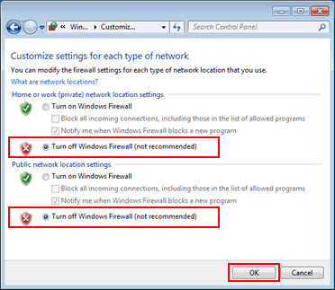

<div style="page-break-after:always" />

- **Disable Windows AutoUpdate**

<div style="text-align: center;">
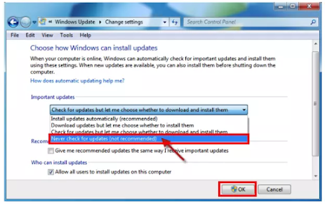


### Network Configuration

It's recommended to set the VM to host-only network but we didn't experimented this. You can find some leads [here](https://amoldighe.github.io/2017/12/20/kvm-networking/).


Configure the network with your own IP address and gateway, here for example we have:

- IP address：192.168.56.101
- Subnet mask：255.255.255.0
- Default gateway：192.168.56.1
- Preferred DNS server：8.8.8.8
- Alternate DNS server：8.8.4.4

<div style="text-align: center;">
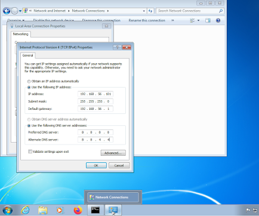


Make sure both the guest (Win7) and host (Ubuntu) can be ping each other :


<div style="text-align: center;">


<div style="text-align: center;">


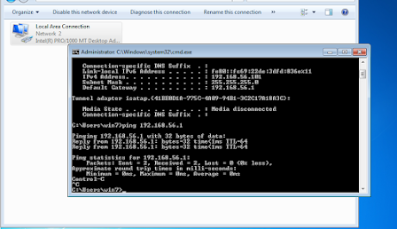


### Disable Noisy Network Services

#### Teredo

Open a command prompt as Administrator, and run :

```shell
netsh interface teredo set state disabled
```

#### Link-Local Multicast Name Resolution (LLMNR)

Open the Group Policy editor. Then navigate to Computer Configuration > Administrative Templates > Network > DNS Client, and open Turn off Multicast Name Resolution.

Set the policy to enabled :

<div style="text-align: center;">


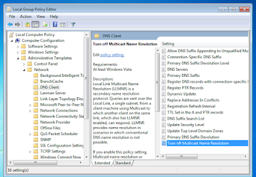


#### Network Connectivity Status Indicator, Error Reporting, etc

Open the Group Policy. Then navigate to Computer Configuration > Administrative Templates > System > Internet Communication Management, and open Restrict Internet Communication.

Set the policy to enabled :

<div style="text-align: center;">


![Enable Restrict Internet Communication]./images/network_connectivity_disabling.png "Enable Restrict Internet Communication")


### Install and run the CAPE Agent

Download the agent [here](https://raw.githubusercontent.com/kevoreilly/CAPEv2/master/agent/agent.py). Copy the file into the Win7 VM.

Running (double click) the agent.py will launch the HTTP server which will be listening for connections.

If you want the script to be launched at Windows’ boot, just place the file in the Startup folder. The All Users startup folder should be ```C:\ProgramData\Microsoft\Windows\Start Menu\Programs\Startup```.

### Take VM snapshot

After start agent.py and minimize it, create a snapshot with the name "Snapshot1".


<div style="text-align: center;">
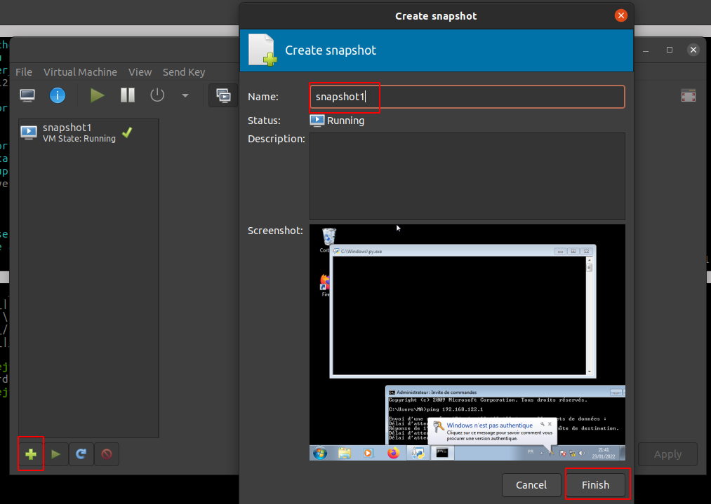


### CAPE Configurations

Don't forget to read the [configurations documentation](https://capev2.readthedocs.io/en/latest/installation/host/configuration.html) to understand the configurations as yours might be different with my configuration. Important files to be configured in /opt/CAPEv2/conf:

- cuckoo.conf
  - Change the IP address

<div style="text-align: center;">
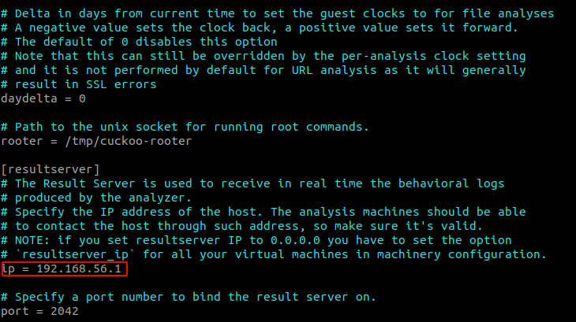


- auxiliary.conf

  - Configure with your own requirement

- kvm.conf

  - Change label, ip, snapshot name

  <div style="text-align: center;" width="150">
  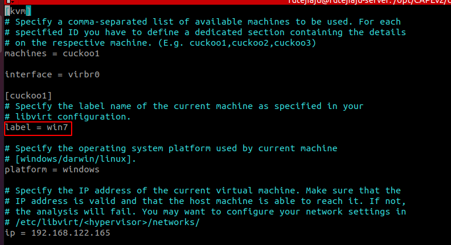
  
  
- memory.conf

  - Change the guest_profile to your VM name , here win7

  <div style="text-align: center;">
  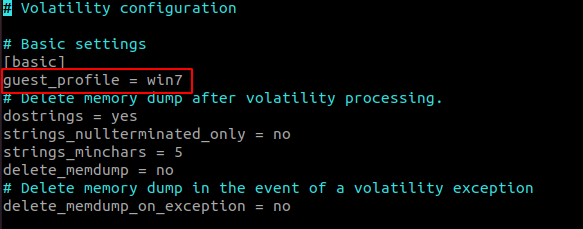
  
  
- reporting.conf

  - Configure with your own requirement

- web.conf

  - If you'd like you can enable scoring :

  <div style="text-align: center;">
  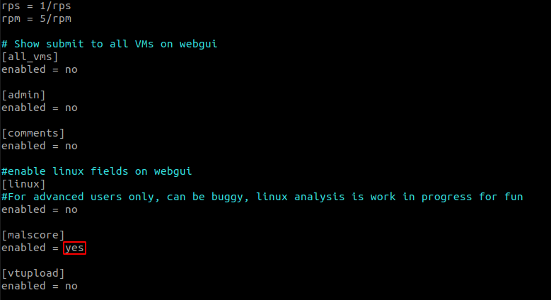
  
  


  - Or configure with your own requirement

## Run CAPE and Webserver

### Run Cuckoo

First you have to make last installations in order to allow the replay of HTTP and HTTPS requests :

```shell
$ cd /opt/CAPEv2/utils
$ sudo python3 community.py -cr
$ sudo pip3 install -U git+https://github.com/CAPESandbox/httpreplay
```

Then we just have to run cuckoo :

```shell
$ cd /opt/CAPEv2/
$ sudo python3 cuckoo.py
```

### Run Webserver

For web, in a new tab, run these command :

```shell
$ cd /opt/CAPEv2/web
$ sudo python3 manage.py migrate
$ sudo python3 manage.py runserver 0.0.0.0:8090
```

### Run Processing

If you want CAPE to process the information you should run :

```shell
sudo python3 process.py -p7 auto
```

If get an error on this command, try to lower the number of parallels threads used with the flag ```-pX``` and X equal to the number of threads used.

# OpenCTI

 You can choose the way you want to install OpenCTI on the [official wiki](https://www.notion.so/Installation-and-upgrade-f0f3308ed5c94ecba341d714a4d4dc3b).

 It is recommended to use  **Docker**, you can follow the official OpenCTI docker [installation instructions](https://www.notion.so/Using-Docker-03d5c0592b9d4547800cc9f4ff7be2b8).

# MISP

## Docker

MISP developed a Docker container, you can deploy it following the Github [installation instructions](https://github.com/MISP/misp-docker).

## Manual deployment

If you wish to install MISP on your machine, you can follow the official [installation instructions](https://misp.github.io/MISP/INSTALL.ubuntu2004/) of MISP.

# Connect Instances

## CAPE &harr; OpenCTI

We will use the [CAPE connector](https://github.com/OpenCTI-Platform/connectors/tree/master/external-import/cape) developed by OpenCTI team. Add the code of the _Connector docker-compose.yml_ content to your _OpenCTI docker-compose_ .

:exclamation:**Warning :**
You will probably encounter network problem saying ```API is not reachable```. Indeed your CAPE instance is running on your machine and your OpenCTI instance on docker. This docker has his own internal network. In order to bypass those network problem, you should add ```host.gateway``` parameter to your docker-compose file. You can change the _host.docker.internal_ to whatever you'd like.

<div style="text-align: center;">


## CAPE &harr; MISP

The functionality to transfer data to MISP is already built into CAPE. There is a MISP section in the [reporting.conf](https://capev2.readthedocs.io/en/latest/installation/host/configuration.html?highlight=reporting.conf#reporting-conf) file that allows you to enter the parameters of the MISP instance to be connected.

<div style="text-align: center;">


## MISP &harr; OpenCTI

Like CAPE, we will use [MISP official connector](https://github.com/OpenCTI-Platform/connectors/tree/master/external-import/misp) developed by OpenCTI.

As mentioned in the github connector README :

>Enabling this connector could be done by launching the Python process directly after providing the correct configuration in the config.yml file or within a Docker with the image opencti/connector-misp:latest. We provide an example of docker-compose.yml file that could be used independently or integrated to the global docker-compose.yml file of OpenCTI.

You could encounter the [same network problem](##CAPE-&harr;-MISP) as for Cape Connexion. Be sure your docker container are on the same network if your use MISP with docker. Otherwise if you had manually deployed MISP add the ```host.gateway``` argument in your _docker-compose.yml_.


## OpenCTI &harr; OpenCTI

It is possible to retrieve this stream by creating a synchroniser. All you need is the URL of the OpenCTI instance, an authentication token and the ID of the stream you want to retrieve.

<div style="text-align: center;">
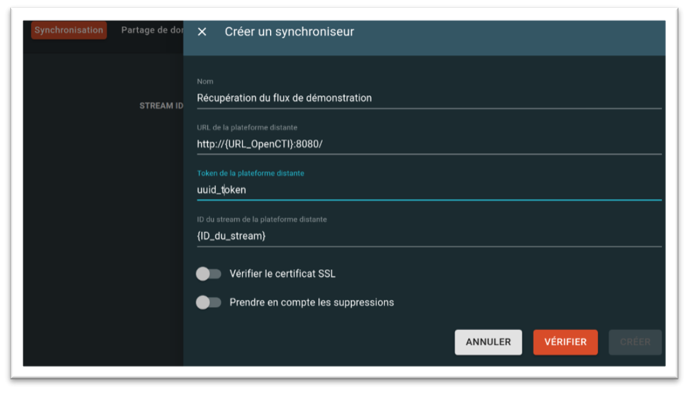


Once the stream has been created, all that remains is to start or stop it.

<div style="text-align: center;">
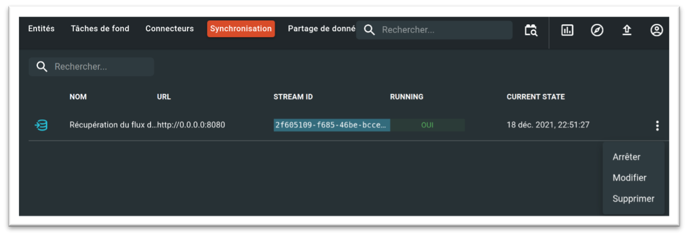


There are others methods, please refer to [this article](https://medium.com/luatix/opencti-data-sharing-6da7dc045d14?source=collection_home---2------0-----------------------) on data sharing with OpenCTI.


# Sources

- [CAPE v2 installation](https://notes.netbytesec.com/2020/12/cape-sandbox-installation-from-0-to-hero.html) by NetBySec
- [CAPE v2 official documentation](https://capev2.readthedocs.io/en/latest/index.html)
- [ CAPE installation tutorial](https://www.ctechmat.fr/?p=29946) by CTechmat
- [OpenCTI wiki](https://www.notion.so/OpenCTI-Public-Knowledge-Base-d411e5e477734c59887dad3649f20518)
- [OpenCTI data sharing article](https://medium.com/luatix/opencti-data-sharing-6da7dc045d14?source=collection_home---2------0-----------------------) by Luatix

